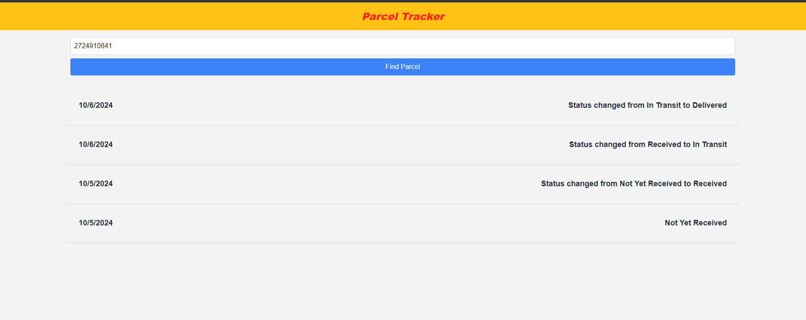
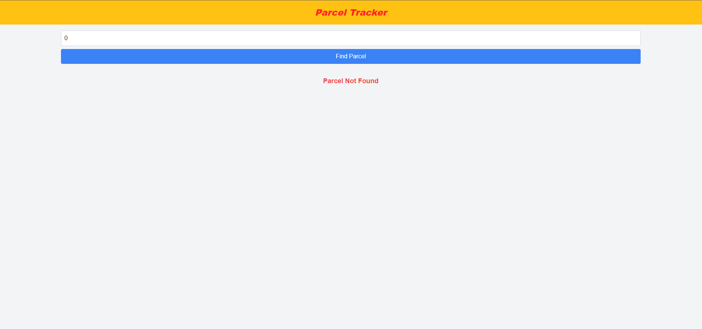

# **PARCEL TRACKER WEB APP**
This application is a simple web app using the following stack:
- Frontend -> NextJS using App Routing, TailwindCSS, TypeScript, and Axios for REST API connections
- Backend -> NodeJS, TypeScript and TypeORM for database connection using Express for REST API
- Database -> PostgreSQL

All are services (frontend, backend, and database) are containerized.

## **Pre-requisites**
- install `docker` on your machine
- Clone the Repository and make sure to create and define environment variables in `.env` file in the root directory:
    -   `POSTGRES_USER`
    -   `POSTGRES_PASSWORD`
    -   `POSTGRES_DB`
    -   `SERVER_PORT`
    -   `POSTGRES_PORT`
    
example:
```
POSTGRES_USER=user
POSTGRES_PASSWORD=password
POSTGRES_DB=mydb
SERVER_PORT=4000
POSTGRES_PORT=5432
```

- In the frontend directory define a .env file also that will map NEXT_PUBLIC_API_URL to your local machine's IP address. This will allow other devices in your network to also access the webapp using the IP address of your machine.
    - example:

    ```
    NEXT_PUBLIC_API_URL=http://<your_ip_address>:4000
    ```


- At the moment only the related PARCEL ACTIONS can be viewed in the website, there is no way to add parcels using the web app:
    - In order to add parcels and update parcel actions run commands in the CLI:
        - Add Parcel - `curl -X POST http://localhost:4000/parcels`
        - Update Parcel - `curl -X PUT http://localhost:4000/parcels -H "Content-Type: application/json" -d '{"status": "Received"}'` 
            - The following "Value" for status must be the following:
                - "In Transit",
                - "Delivered",
                - "Cancelled",
                - "Returned To Seller",
                - "Delivery Attempt Failed",
                - "Received",
                - "Not Yet Received"
        - Get all Parcels to view parcel IDs - `curl -X GET http://localhost:4000/parcels`
    - Or you can use POSTMAN to run the same commands.


## **Run**
- Run in CLI in the root directory:
    - `docker compose build`
    - `docker compose up -d`
    - access webapp on your browser using: http://localhost:3000

### **Sample Images**
    - Parcel Found in search:
        

        
    - Parcel Not Found in search:
        
